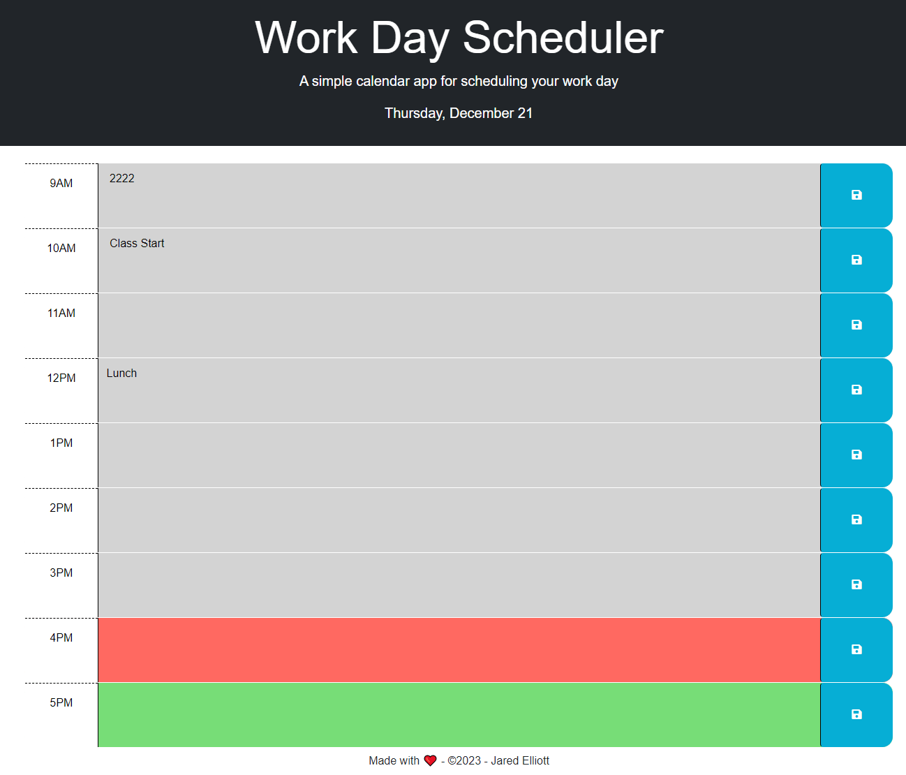

# Work-Day-Scheduler
A simple calendar application that allows a user to save events for each hour of a typical working day (9am–5pm).

# Usage
* Opening the planner site will display the current day at the top of the calendar
* Page will contain time blocks for standard business hours of 9am to 5pm
* Each time block is color-coded to indicate whether it is in the past, present, or future
* Cliking a time block will allow the user to enter an event/information
* Clicking SAVE button will save information to local storage
* Refreshing the page will show saved events persist

# Installation
[GitHub-Repo](https://github.com/CLTJared/Work-Day-Scheduler)

[Install-Command] `git clone git@github.com:CLTJared/Work-Day-Scheduler.git`

# Demo

[GitHub-Demo](https://cltjared.github.io/Work-Day-Scheduler/)